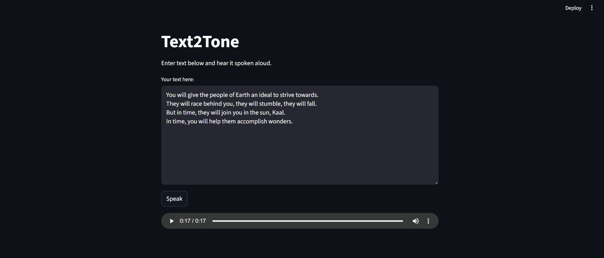

# Text2Tone (Online Mode)

This is the online version of **Text2Tone**, powered by `gTTS` and built with Streamlit. It converts user-inputted text into speech using Google’s Text-to-Speech API.

> Requires internet. Just type, hit "Generate Voice", and listen.

---

## 🔧 What it does

- Converts text to speech using Google TTS (`gTTS`)
- Uses a simple Streamlit UI
- Generates and plays the audio in-browser
- Saves the output as a `.wav` file

---

## 🖼️ Demo

---

## 🔊 Sample Output

Listen to an example generated by the app:  
[▶ Download or play text_to_speech_gtts.wav](text_to_speech_gtts.wav)

