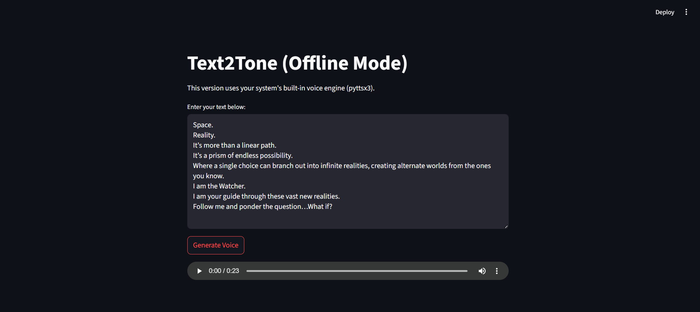

# Text2Tone (Offline Mode)

This is the offline version of **Text2Tone**, powered by `pyttsx3` and built with Streamlit. It converts user-inputted text into speech using your system's built-in voice engine.

> No internet required. Just type, hit "Generate Voice", and listen.

---

## 🔧 What it does

- Converts text to speech using `pyttsx3` (SAPI5 / NSSpeechSynthesizer / espeak)
- Uses a simple Streamlit UI
- Generates and plays the audio on the fly
- Automatically deletes the temporary audio file after playback

---

## 🖼️ Demo

---

## 🔊 Sample Output

Listen to an example generated by the app:  
[▶ Download or play test_male_Voice.mp3](test_male_Voice.mp3)
